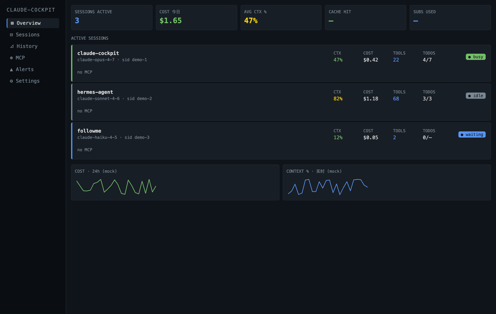

# claude-cockpit

> Multi-session dashboard + control console for Claude Code. The Grafana-style HUD claude-hud doesn't ship.



## Quickstart

~~~bash
npm install -g claude-cockpit
claude-cockpit configure          # 8-step interactive wizard
# Restart Claude Code; statusline + dashboard auto-wire
~~~

That's it. The wizard sets up your `~/.claude-cockpit/config.json`, optionally patches `~/.claude/settings.json` to point at this install, and (on macOS) sends a test notification to verify permission.

## Why

`claude-hud` shows you ONE Claude Code session in your statusline. Cool, but —

- I run 3 Claude Codes in parallel. I want to see all of them at once.
- I want to *click* to jump to the file Claude just edited.
- I want to know which session is burning money right now.
- I want trends over time.

`claude-cockpit` is that.

## What you get (v1.0 beta)

Everything in v0.9 beta **plus**:

- **`npm install -g claude-cockpit`** — published on npm; no more git clone.
- **`claude-cockpit configure`** — 8-step interactive wizard (preset / theme / language / alert rules / thresholds / retention / notification test / settings patch).
- **`claude-cockpit status`** — daemon liveness + DB size + statusline wiring check, all in one command.
- **Three statusline presets** — Minimal (1 line) / Essential (default) / Full (2 lines + cache + tool names + other-session count). Pick in the wizard or in `config.json.statuslinePreset`.
- **Light / Dark / Auto theme** — dashboard toggle in sidebar; respects `prefers-color-scheme` when Auto.
- **EN / 中 i18n** — full dashboard UI in English or 简体中文; toggle in sidebar.

### Statusline preset comparison

| Preset    | Lines | Includes                                                                          |
|-----------|-------|-----------------------------------------------------------------------------------|
| Minimal   | 1     | model · cwd · branch · ctx% · [cockpit]                                           |
| Essential | 2     | + tools · subagents · todos · [dash] [stop] [file] · gauges                       |
| Full      | 2     | + cache token count · top-3 tool names · "others ×N" siblings on line 2          |

---

## What you get (v0.9 beta)

Everything in v0.5 beta **plus**:

- **History layer** — every session / tool call / alert / 5h-7d usage snapshot is persisted to `~/.claude-cockpit/cockpit.db` (SQLite WAL). 5-second batched flush; 90-day rolling cleanup at local midnight.
- **`/history` page** with three tabs:
  - **Trends** — 30-day daily cost bar, cache hit rate line, 5h/7d subscriber-usage history
  - **Top** — `metric × dimension` matrix (cost / tokens / tool-calls × project / tool / session)
  - **Projects** — per-project totals + last activity, grouped by `workspace.project_dir`
- **Overview Sparklines** are now backed by real 24-hour aggregates — no more mock data.
- **`cost-spike` baseline** has graduated from in-memory rolling to SQLite 7-day window — more stable, survives daemon restarts.

### Backup your history

Three SQLite files in `~/.claude-cockpit/`:

~~~bash
cp ~/.claude-cockpit/cockpit.db* /your/backup/dir/
~~~

(Daemon must not be running, or copy while idle. WAL files are part of consistency — copy all three.)

### Clear history

Either through the dashboard ("Clear all history…" on the Projects tab, with confirm modal) or via curl:

~~~bash
curl -X POST http://localhost:<port>/api/history/clear
~~~

### Configuration

Optional in `~/.claude-cockpit/config.json`:

~~~jsonc
{
  "retentionDays": 90,        // history rolling window; default 90
  "historyFlushMs": 5000      // batch flush interval; default 5000
}
~~~

### Graceful degradation

If `better-sqlite3` fails to load (Alpine glibc / unsupported arch / missing build tools), the daemon stays alive, statusline / Overview / detail page work normally — only `/history` shows "History unavailable" and `cost-spike` rule falls back to its v0.5 behavior.

---

## What you get (v0.5 beta)

Everything in v0.1 alpha **plus**:

- **Smart alerts**: 4 built-in rules (ctx-high / cost-spike / loop-detect / subagent-stuck) fire native macOS / Linux system notifications; configurable / toggle-able via `~/.claude-cockpit/config.json`.
- **Working control actions**: `[stop]` / `[file]` OSC 8 statusline links actually work. Dashboard Stop / Open file / Copy id / Focus terminal buttons too.
- **Session detail page** `/sessions/:id` with live CTX chart, 5-min tool bar chart, todos, and event timeline.
- **Subscriber usage bars (5h + 7d)** in both statusline and dashboard, read live from Claude Code's `rate_limits` field.

### About the 5h / 7d windows

These two values come straight from Claude Code's stdin and reflect Anthropic's
own internal rate-limit counters — cockpit displays them faithfully, it doesn't
recompute them. Their semantics are **not the same**:

- **`5h`** — a rolling 5-hour window. The clock starts on your first request
  after the prior reset. Reset time shifts forward as you keep using it.
- **`7d`** — a **weekly** quota aligned to your account's billing-week
  boundary. **Not** a rolling-past-7-days count. After the weekly boundary
  the counter goes to 0 and starts accumulating fresh — so a 70% reading on
  one Friday and a 1% reading on the next Friday is normal: a reset happened
  in between.

If the numbers look surprisingly low after a reset boundary, that's the
expected behavior, not a cockpit bug.

### System dependencies

- **macOS**: `osascript` (system, always present). First-run shows a system notification permission prompt — allow it for alerts to work.
- **Linux**: `notify-send` (libnotify, install via your package manager). `wmctrl` optional for Focus terminal action — degrades gracefully if missing.

### config.json (optional)

`~/.claude-cockpit/config.json`:

~~~jsonc
{
  "disabledRules": ["loop-detect"],
  "loopDetectThreshold": 12,
  "ctxHighThresholdPct": 85
}
~~~

## What you get (v0.1 alpha)

- **Statusline plugin** (drop-in replacement for claude-hud): Essential preset by default — 2 rows with model, cwd, ctx %, cost, tools, todos + OSC 8 clickable `[dash]` `[stop]` `[file]` links.
- **Multi-session dashboard** (Grafana style): browser-based, lazy-started local daemon at `http://localhost:<port>`.
- **Click `[dash]`** → opens dashboard pinned to that session.
- **MCP detection**: tells you which MCP servers Claude has configured (per-session health indicator on each card).
- **Lazy daemon**: spawns on first statusline refresh, auto-exits after 30 min idle. No services to install.

## How it works

Three layers, all on `localhost`, zero external requests.

```mermaid
flowchart LR
    subgraph CC["Collection · per Claude Code instance"]
        direction TB
        S1["Claude Code #1"] -->|stdin JSON| SL1["statusline plugin<br/>fork each refresh"]
        S2["Claude Code #2"] -->|stdin JSON| SL2["statusline plugin"]
        S3["Claude Code #3"] -->|stdin JSON| SL3["statusline plugin"]
    end

    subgraph D["Coordination · cockpit daemon (lazy, 1 per user)"]
        direction TB
        Reg["SessionRegistry<br/>Map&lt;sid, SessionState&gt;"]
        Watcher["TranscriptWatcher<br/>tail JSONL"]
        WSB["WsBroadcaster"]
        API["HTTP /api/sessions"]
        IC["IdleChecker · 30min<br/>auto-shutdown"]

        JSONL[("~/.claude/projects/<br/>**.jsonl")] -->|fs.watch| Watcher
        Watcher -->|TOOL_USE / USAGE| Reg
        Reg --> WSB
        Reg --> API
        Reg -.-> IC
    end

    subgraph P["Presentation · browser"]
        DASH["Vite + React Dashboard<br/>µPlot Sparklines"]
    end

    SL1 -->|Unix socket<br/>UPDATE_SESSION| Reg
    SL2 -->|Unix socket| Reg
    SL3 -->|Unix socket| Reg
    SL1 <-->|HTTP GET /api/sessions/:id| API

    WSB -->|WebSocket<br/>SESSION_UPSERT diff| DASH
    API -->|initial GET| DASH
    DASH -.->|OSC 8 click [dash]| SL1
```

**Why two data sources into SessionRegistry?** The statusline plugin gives us low-latency "session is alive" signals on every refresh (~300ms cadence). The `TranscriptWatcher` tails the actual `*.jsonl` transcript and gives us ground-truth `tool_use` events and `usage` token counts. They cross-check each other — if one drops a beat the other catches it.

**Why lazy daemon?** Nothing to install, nothing to launchctl. First statusline refresh detects the missing Unix socket, double-fork-spawns a detached daemon, then 30 min after the last session update the daemon exits on its own. `~/.claude-cockpit/daemon.json` carries the random HTTP port between processes.

### One refresh, end to end

```mermaid
sequenceDiagram
    autonumber
    participant CC as Claude Code
    participant SL as statusline (subprocess)
    participant D as daemon
    participant W as TranscriptWatcher
    participant B as Dashboard (browser)

    CC->>SL: stdin JSON
    SL->>D: ping unix socket (80ms)
    opt daemon not running
        SL->>D: spawn detached + double-fork
        Note over D: 200ms wait; SL exits, daemon survives
    end
    SL->>D: UPDATE_SESSION { sid, cwd, model, ... }
    D->>D: SessionRegistry.upsert(sid)
    opt first sight of this sid
        D->>W: start watcher on transcript_path
    end
    W-->>D: TOOL_USE / USAGE events (async)
    D->>D: compute ctxPct, append tool, persist
    D->>B: WebSocket SESSION_UPSERT
    SL->>D: GET /api/sessions/:sid
    D-->>SL: merged SessionState
    SL-->>CC: 2-line rendered output<br/>with OSC 8 links
```

The hot path (statusline refresh) is ~50–80ms once the daemon is warm. Cold start (first refresh of a session) is ~500ms — dominated by `tsx` warmup of the daemon.

### File layout

```
claude-cockpit/
├── packages/
│   ├── shared/         # cross-package types: SessionState, RpcFrame
│   ├── statusline/     # Claude Code statusline plugin (fork per refresh)
│   │   ├── bin/        # CLI entry
│   │   └── src/        # stdin parse, render, OSC 8, RPC client, lazy spawn
│   ├── daemon/         # long-running coordinator
│   │   ├── bin/        # CLI entry (top-level await + signal handlers)
│   │   └── src/
│   │       ├── socket-server.ts       # Unix socket RPC
│   │       ├── http-server.ts         # HTTP + WebSocket + static SPA
│   │       ├── session-registry.ts    # in-memory state
│   │       ├── transcript-watcher.ts  # tail JSONL → events
│   │       ├── mcp-inspector.ts       # parse ~/.claude/settings.json
│   │       ├── lifecycle.ts           # idle check + graceful shutdown
│   │       ├── api/                   # /api/sessions routes + WS
│   │       └── platform/              # macOS + Linux abstraction
│   └── dashboard/      # Vite + React + TanStack Router + Tailwind + µPlot
└── tests/e2e/          # full lifecycle integration (spawn → register → API)
```

## Roadmap

- ✅ **v0.5** (shipped) — Smart alerts + system notifications + working `[stop]` / `[file]` actions + session detail page + 5h/7d subscriber usage bars + ANSI-colored statusline.
- ✅ **v0.9** (shipped) — SQLite history layer + `/history` page (Trends / Top / Projects tabs) + Sparkline real data + cost-spike baseline migrated to 7d window.
- ✅ **v1.0** (shipped — current) — `npm install -g`, configure wizard, statusline presets, light theme, EN/CN i18n.
- **Future** — `/alerts` feed page, Linux notify-send action callbacks, Windows support.

## Develop

If you want to hack on cockpit itself, work from source:

```bash
git clone https://github.com/shaunvvip/claude-cockpit
cd claude-cockpit
npm install
npm run -w packages/dashboard build
```

Wire the statusline in `~/.claude/settings.json`:

```json
{
  "statusLine": {
    "type": "command",
    "command": "npx tsx /absolute/path/to/claude-cockpit/packages/statusline/bin/statusline.ts"
  }
}
```

Restart Claude Code. First refresh lazy-starts the daemon. Click `[dash]` to open the dashboard.

## Supported terminals (OSC 8 clickable links)

- iTerm2, Ghostty, WezTerm, Kitty, VS Code integrated, Warp, Alacritty
- macOS Terminal.app falls back to plain text (no clickable links)
- Use `/cockpit:open` slash command as a universal fallback (Phase 4)

> **How to click the links**: OSC 8 hyperlinks require a modifier key on most
> terminals — **⌘-click** on macOS (iTerm2, Ghostty, VS Code), **Ctrl-click**
> on Linux (WezTerm, Kitty). A plain click does nothing on purpose, to avoid
> accidental navigation while editing.

## Privacy

The daemon stores **only session metadata** (cwd, model, tokens, tool names — NOT transcript content). Everything is local — zero external requests. Code is auditable.

## Platforms

Tested on macOS and Linux (matrix CI). Windows support is community-vendored — see `packages/daemon/src/platform/` for the abstraction.

## Development

```bash
npm install
npm test              # 87 unit tests
npm run test:e2e      # 2 end-to-end tests
npm run typecheck     # type-check across workspaces
npm run -w packages/dashboard dev    # vite dev server
npm run -w packages/dashboard build  # production build
```

## License

MIT
